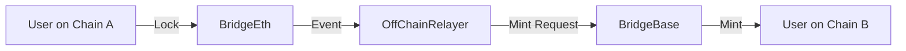

<!-- Banner/Logo suggestion -->
<p align="center">
  
</p>

<p align="center">
  <a href="#"></a>
  <a href="#"></a>
  <a href="#"></a>
</p>

# EVM Bridge

> **A simple, creative cross-chain token bridge for EVM-compatible blockchains!**

---

## Features

- **ERC20 token** with mint & burn
- **Owner-only** minting & unlocking
- **Event logging** for all bridge actions
- **Cross-chain** asset transfer support

---

## Contracts

| Contract            | Description                                                      |
|--------------------|------------------------------------------------------------------|
| `Token.sol`        | ERC20 token with mint/burn, owned by deployer                     |
| `BridgeBase.sol`   | Base bridge for locking/unlocking tokens, owner-only unlock       |
| `BridgePolygon.sol`| Polygon bridge, owner can mint/burn tokens on Polygon             |

---

## Directory Structure

```text
contracts/
  ├── Token.sol
  ├── BridgeBase.sol
  └── BridgePolygon.sol
```

---

## Quick Start

1. **Install dependencies:**
   ```bash
   npm install
   ```
2. **Compile contracts:**
   ```bash
   npx hardhat compile
   ```
3. **Run tests:**
   ```bash
   npx hardhat test
   ```

---

## Usage

- Deploy `Token.sol` to your network.
- Deploy `BridgeBase.sol` or `BridgePolygon.sol`, passing the token address.
- Use bridge contracts to lock, mint, burn, or unlock tokens as needed.

---

## How It Works



---

## Requirements

- Node.js
- Hardhat
- OpenZeppelin Contracts (v4.9.6+)

---

## ⚖️ License

[MIT](./LICENSE)

---

<p align="center">
  <b>Made with ❤️ for the EVM ecosystem</b>
</p>
